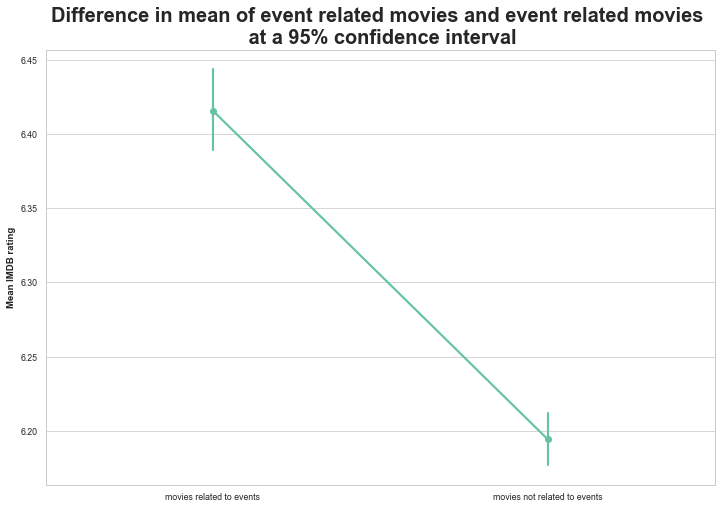
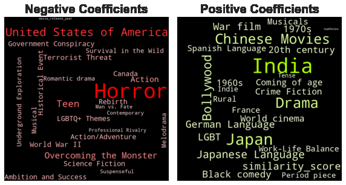

# Introduction:

Hello everyone ! Welcome to the world of movies. Are you a movie enthusiast who constantly scrolls through IMDb to pick your next watch? Do you ever wonder what makes a movie stand out? If so, you're in the right place.

Cinema is one of the most popular forms of art, with millions and even billions of viewers around the world. Moreover, it is the most evergreen entertainment industry. Many artists from all over the world exhibit their talent to the viewers with the goal of winning the hearts of many people.

We're going to take a close look at the IMDb ratings for movies. We would like to know why a movie has a good IMDb rating or not. Does it have to do with how much the movie costs or who are the actors? We'll find out more.

Within this story lies the secret formula to what makes a movie not just good, but marvelous. We're talking about those films that stick in your mind for a lifetime, that earn the top ratings on platforms like IMDb. And trust us, in the world of cinema, IMDb ratings are the Holy Grail, a reference and a symbol of cinematic success.

So buckle up, movie buffs. Let's hack our way through the world of cinema!

# Let us tell you about our Datasets

Our dataset consisted of mainly 4 sources:

1. **The CMU Movie Summary Corpus Dataset**: This dataset consists of 42,306 movie plot summaries extracted from Wikipedia. It provides detailed character information in each movie and includes comprehensive data on movies' revenue, genre, release date, runtime, and language.
2. **IMDb Rating Dataset**: Our analysis integrates the IMDb rating dataset that completes the CMU dataset to get the rating of each movie.
3. **Events Dataset**: Supplementary data, generated by ChatGPT, is included in the analysis. This dataset captures the most significant events from 1820 to 2014.
4. **Oscars Dataset**: This dataset is a collection of data from The Academy Awards Database, containing the winners and nominees of the Oscars from 1927 to 2023. It completes the characters CMU dataset.

# Number of Votes Effect on the IMDb Rating

We kick off our analysis with the most obvious factor one can think of **Popular movies have higher ratings**. To address this million-dollar question, we first need to investigate the correlation between the IMDb ratings of movies in our dataset and their popularity. How are we going to measure the popularity of a movie? Well, there are several metrics that we can consider but we opted for a more efficient metric which is the number of IMDB reviews.



At the first look this plot shows two things. First, the high density of movies rated between 4 and 8. This is expected since distributions of this kind are usually normal and centered around the average rating, which is 5 in our case. The second insight that we can get from this is that the regression fitted in this plot is positively correlated to the number of votes, meaning that the more popular the movie is the higher its IMDB rating will be. This might be too naive to say since we can see that the line at lower IMDB ratings is rather flat. That’s why we need to dive deeper into the details of this distribution. We divide the movies into multiple bins representing intervals for the number IMDB votes and we plot the distribtuions of the average ratings in each bin.



Here it is clear that the positive correlation that we got in the previous plot only appears after a certain number of votes, approximately 100'000. Otherwise, the popularity of the movie doesn’t imply high IMDB rating.

To wrap-up this first section, we can say that the million dollar question that we wanted to answer is still open. However, now you know that unless your favorite movie hits the 100'000 votes threshold in IMDB, its increase in popularity won’t improve its score.  Additionally, enthusiasts of highly popular movies (1M votes and above) can rest assured, as the IMDb rating, backed by the ADHD group, reliably exceeds an 7.9 score.

# High Box Office Revenue Effect on the IMDb Rating

Let’s start by dissecting the relation between large revenue generated by the box office and its relationship with its rating. One might think that the IMDb rating is strictly correlated to the revenue. We investigated this hypothesis and as we shown in the graph below there is no clear relation between how much money a movie has made and how it was rated. This might sound surprising even after fitting a regression, we found a very small coefficient! So small that it indicated that this box office revenue metric should not be considered as a factor that boosts IMDb rating. You might ask "how is it possible?", the answer is as simple as hacking into the NSA; it's **marketing**. The real hackers are the clever marketing experts make us all excited for a movie, spreading the promotion of a movie like a a virus. These marketing stunts create a huge buzz around movies, making sure everyone's talking about them.



Here's a word of caution for all the aspiring movie makers out there; **don't play to much with the hype you create**. If you promise the moon and fail to deliver, people are going to be disappointed. At the end of the day, even though revenue may appear as a parameter or at least an indicator of a film's success in terms of ratings. It turns out, it's not the case, due to the marketing work that has gone into it. It is therefore a parameter that should not be considered in our analysis as apprentice hackers.

# English Might not Be your Best Bet

Let's start this section with a basic fact, english is the most spoken language across the globe. So naturally, one might think that using English in films is the key to unlock the access of viewers worldwide, right? The graph below backs up the later assumption. In fact, nearly 60% of the movies are in English! Coincidence? I don't think so.



Let's not jump to a hasty conclusion to quickly.

Is using the language of Shakespeare in your movie a ticket to success? Well, don't be suprised if your movie gets one or two rotten tomates thrown at it. As our data distribution shows below, audience reception is a whole different.



As we can observe, there are languages that seem to be associated with higher ratings, yet this usually comes together with a larger confidence interval. Thus, we can't directly jump to conclusions. However, we see that with a rather small confidence interval, certain languages, such as German and French, outperform the English language.
This could be linked to the dataset bias, having sampled only the best films where the language is not english and having the whole catalog of English-language films. If this is the case, it might be a good idea to investigate the characteristics of films with languages differing from English to find meaningful insights. A standing ovation isn't guaranteed solely by speaking English. Movies represent more than simple words, as each language unfolds its own captivating story. Regardless of the spoken tongue, the magic of cinema lies in the unique narratives transmitted by every language, offering diverse perspectives and enriching the cinematic experience.

# Countries Effect on the IMDb Rating 

It's time to put to work our triangulation skills and go for an adventure across the globe. Some countries are known for their famous movie industry and their movie culture. Some examples are Hollywood for the United States, Bollywood in India or even the Nigerian industry, one of the biggest producers of movies in the world. We might think that because of their experience in the industry and their experirenced population, these countries have better IMDb rating for their movie.

When investigating the world map of movie ratings, we spot a curious trend.

<iframe src="./map/map_average_rating_per_country.html" width="800" height="600"></iframe>

In fact, the United States, land of the free and harbor of Hollywood, isn't scoring as high as we think, with a modest 6.15 IMDb average. Meanwhile, countries that might not be known for their cinematographic achievement get higher scores. For exmaple, countries like Slovenia, Bosnia, and Iran get much high rating.

So, what's the deal?

One possible answer could be that cinephiles tend to be chauvinist when rating a films from their country, especially when the country is not the most know for it's cinematography. It's like cheering extra loud for your cousin's talent show, it just feels right.

On the other hand, there's the american movie machine, churning out films faster than you can imagine. With this large buffet of genres and choices, opinions are mixed. More movies, more opinions, and you get it… A wider spread of ratings.

As hacking expert we must be very careful when handling this parameter.

This geographical rating rumble might be too simple, almost naive. Is judging a film's worth only by its country of origin relevant? That's like saying all pizzas from Italy must be divine. It's not just about where a film is made. That would be too simple! It's a much more complex combination of parameters, so we need to be more meticulous in our search for parameters influencing how the public reveive movies. We've got to dig deeper, look beyond borders. Because at the end of the day, a great movie can come from anywhere.
Put on your hood and let's hack some more!

# Era Effect on the IMDb Rating 

Did you ever wonder how the old movies performs on IMDB and how different generations percieves them?  With IMDb's inception in 1990, it became a golden ticket for us to gain insights into generationnal cinematic taste and witness the evolution of preferences over time. So, buckle up as we fire up our cinematic time machine, inviting you on a captivating journey through the annals of film history, exploring how the changing landscape of movies echoes in IMDB ratings.



At a first glimpse few details will catch your eyes the most; the huge increase in variation of ratings over movies’ release year, the almost constant upper confidence interval bound, the decreasing lower confidence interval bound etc. But we didn’t include this analysis in our story just to tell you that. 
Eventhough, we were expecting these results, we didn’t expect what’s coming next.
First we want to draw your attention to that red line representing the year believed to be the point in history where movies transitioned from black and white to colors. Now with that red line plotted you can better understand what is happening. Appart from the fact that people tends to appreciate older movies and have higher expectation for newer ones, the introduction of colors in the movie industry resulted immidiatly in a steaper descent of the confidence interval lower bound.

Now, let’s get back to the present and see if the release year of a movie really changes it IMDB rating. To answer this we need to see the bigger picture and plot the rating distribution of movies before and after the transition to colored movies.



Eventhough this analysis was fun and resulted in different interpretations, the movie release year wasn’t a significant factor that we can rely on to predict a movie IMDB rating since as can be seen in the distribution of ratings for movies before and after 1950, there wasn’t a significant difference between the two groups.

# Movies Linked to World Events Effect on the IMDb Rating 

Ah, the magic of films based on a true story! Almost universally loved, there's something special about knowing that the drama unfolding on screen actually happened. It cranks up the emotional intensity, making the movie-watching experience all the more gripping. But here's the burning question, how do we dive into the world of these real-life tales and understand what makes them stand out? 

Well analyzing this was quite a journey! We faced a major challenge because there wasn't any already made list telling us which movies were based on real events. So, we went into full hack mode. First, we used ChatGPT to generate a list of 1903 iconic historical events. Then, we utilized the Bert model to break down the descriptions of these events and the plots of movies into tiny pieces to figure out how similar they were. If a movie's plot had a similarity score higher than 0.77 with an event, we labeled it as a real story. Now, after all that wizardry, here are the results! We crunched the numbers, plotted the difference in mean ratings between movies related to real-world events and those that aren't, and voilà!

We were very happy to see these results after all that hard work we have put in this analysis since here we can clearly see the increase in IMDb rating that validated our efforts. The graph paints a compelling picture – movies linked to real-world events shine brighter on the IMDb rating scale. The mean rating of these films surpassed their fictional counterparts with a noticeable uptick, indicating that audiences appreciate the authenticity and resonance that real stories bring to the big screen. This significant difference in ratings, observed at a 95% confidence interval, adds weight to the argument that grounding movies in reality contributes positively to their reception.

So now here is an ADHD approved cinema secret: the closer a movie gets to real-world events, the higher it climbs in audience appreciation.

# Movie Runtime Effect on the IMDb Rating

Diving into the digital depths of cinematic data, we have spotted some intriguing findings on the impact of movie runtime on IMDb ratings.
By looking closely to the distribution, we see that tendency. On average movie runtime around 100 to 120 minutes have a score around 6.5 



This might lead us to believe that the majority consensus has settled on a runtime that's just long enough to tell a fulfilling story, yet concise enough to keep today's easily distractible audiences engaged. 

Yet, by digging more and more, we encounter a fascinating narrative twist: we have decided to create 3 categories of movies and analyze them, short-length movie with less than 90 minutes, medium-length lying between 90 and 140 minutes, and finally long-length movie with more that 140 minutes.



Short movies, tend to have a lower rating compared to their medium-length peers. And as the minutes mount, the ratings rise, with longer films outpacing the rest.

By fitting a regression, we find out a positive and significant correlation between movie runtime and the corresponding IMDb average rating.

Now, why might this be? It seems that when filmmakers have the luxury of time on their side, they're able to fully develop their narratives, allowing for more complex plot developments and more nuanced character arcs. The audience have ample time to form attachments to the story and its characters. This emotional investment can be potent, often turning into more generous ratings.

Longer films provide a full-course meal of cinematic delights that allow for a richer, more immersive experience. In contrast, their short-film counterparts are like tantalizing appetizers wonderful but sometimes leaving you craving just a bit more.
So, while most films play it safe within the 'ideal' runtime, it's the lengthier epics that have the potential to sweep viewers off their feet and into higher ratings. 

But be careful film buffs, a true expert knows that in this world, it's not just how long these movies are, but how well they use that time to tell a story that really grabs people and gets them to like it a lot.

# Oscars Effect on the IMDb Rating

Oscars are considered to be the ultimate award for any actor, but is it a game changer factor for a movie rating? We let’s dig into the effects of the Oscars ceremony on the IMBb rating. 
The Oscar is an american ceremony that rewards the work of people involved in movie making since 1929. The multitude of award categories give a wide selection of movies to look forward to. Especially since the people choosing the winners are renown movie industry professionals. The winners get to go home with an iconic statue. However, the winners are not the only ones being brought to the frontfore, an Oscars nomination is also a great achivement for some movies.
Let’s see if the IMDb audiance can be influenced by an Academy Award win or even a nomination.



First seeing the distribution for Nominated Movies or Movies with Oscars nominees in their cast, we can spot the significant increase in rating the Oscars nominations can bring to the IMDB rating of a movie since not only the rating median of the movies having an Oscar is 7.55 whereas it is equal to 6.3 for those who don’t but also the variance of ratings in the Oscars winning group is much lower than the other group. So having Oscars nominees in the cast of a movie is like a guarantee that the movie will achieve higher IMDB rating. 

Switching to the Oscar Winners plot we see that the variance in the Oscar’s winning group is even lower than the Nominee group. Also the median has increased to 7.9 which further endorses the fact that Oscars are an important factor in the IMDB rating world.

Including an Oscar winner or nominee can be very rewarding in terms of rating but very expensive and out of reach for some movie producers, so let’s see if we have a cheaper alternative that movies can use to Hack the system.

# Diversity Effect on the IMDb Rating 

At this point, we have a great way to hack the IMDb rating. However, we are going to go further into the hack to make sure we’ll get the best rating ever. We are going to select our cast of actors and actresses that will appear in front of the camera. We could select our cast in terms of a bunch of factors such as high, age, gender or ethnicity. We are going to focus on the last factor that is ethnicity.
We would like to determine if the IMBd audience is sensitive to a great diversity of ethnicities in the cast. To start, we are going to see how the number of actors in a movie affect the rating.
Then, we are going to compute an ethnicity score going from 0 to 1 that determines the diversity in a straightforward way from the number of ethnicities in a movie divided by the number of actors in a movie. When the ethnicity score is close 0, the movie does not have a great diversity, meaning that every actor is from the same origin and conversely, when it’s close to 1, almost each actor is from a different ethnicity.
To dive even deeper, we are going to compute a different metric that now encapsulates the uniformness of the distribution of the ethnicities. To do this we use our handy information theory entropy to compute a score called the Shannon Diversity Index (SDI). This index is high when the distribution is more uniform and closer to zero when the distribution is not uniform at all.

## Number of Actors Effect on the IMDb Rating
Let's zoom in on the cinematic stats that tell us about the number of actors starring in movies and how it influences their IMDb ratings. Looking at our first distribution, it's clear that most movies have fewer than 20 actors in the mix.



Now, when we throw our eyes over to the second graph, we spot a neat little trend as the number of actors goes up, so does the average IMDb rating.



It's a positive correlation, not a strong one, but significant enough to make us think that this could mean that movies with more characters offer a richer story, more for us to get hooked on, like a bigger cast of characters in a novel. It's not just about having a crowd of actors, though. It’s like cooking; more ingredients can make a dish tastier, but only if you know how to mix them right. The same goes for movies a bigger cast needs to be used well to make the film better. So, this number-of-actors thing seems to be an important ingredient in the secret sauce of movie ratings. Directors who can juggle with many characters and give them all a moment to shine might just see their movies climb up the IMDb rating ladder.

## Ethnicity Effect on the IMDb Rating

For the ethnic diversity, we've got a graph that measures how the mix of ethnicities in a film's cast relates to the average IMDb rating it receives. Our diversity score ranges from 0 to 1, where a higher score means the movie boasts a more varied ethnic lineup.

Now, you'd think, with the world becoming more connected and cultures intermingling like never before, movies representing this diversity would be the darlings of audiences.
Well, this graph throws a bit of a plot twist. It seems that films with a lower diversity score, meaning a less ethnically varied cast, tend to nab higher ratings.



It might say something about audience preferences or industry trends. Maybe viewers are drawn to stories that focus deeply on a specific cultural experience, or perhaps it's a reflection of the types of movies that are being made. This doesn’t say that diversity isn't important far from it.

In fact, by stepping deeper into our examination of the correlation between ethnic diversity in film and audience reception, we have refined our metrics to more accurately capture the nuances of on-screen representation. This tool, known as the Shannon Diversity Index (SDI), assigns to films a score ranging from 0 to 3 based on the uniformity of ethnic representation within their casts.

A score approaching 3 indicates a film with highly equitable ethnic representation, while a score closer to 0 reflects significant disparity or underrepresentation.



The graph presented a positive correlation between a film’s SDI score and its average IMDb rating. This suggests that films which attain a higher degree of ethnic diversity, as quantified by the SDI, tend to receive more favorable evaluations from audiences.

The inference here is clear: there is a marked preference among viewers for a more balanced and inclusive movies. This phenomenon may be interpreted as a reflection of a societal trend towards inclusivity and a desire to see a more authentic reflection of the global community within cinematic narratives.

These two parameters are thus important and needed to be taking into account in order to maximize our chance to produce a success movie.

# Refocusing on Film Aesthetics and Vibes

Instead of delving deep into production details and external elements, let's consider the essence of films - their stories and how they're told. Genres, serving as indicators of narratives and moods, are crucial for understanding films' impacts on audiences. To grasp genre trends, we'll examine genre distributions across selected time periods, revealing their evolving popularity.



Our study highlights the significant role of drama in films' IMDb ratings. Often blended with other genres, drama frequently appears in top-rated films, suggesting its strong resonance with viewers. This trend, observed over a decade, shows a clear alignment between popular genres and high ratings, with some exceptions. Films in less common genres occasionally emerge as hits, defying expectations. This complex interplay between genre popularity and perceived quality underscores the nuanced nature of film appreciation.

# Beyond Genres: Natural Language Processing and Plot Analysis

However, genres alone don't capture a film's full story. Even films in the same genre can differ vastly in themes and execution. To delve deeper, we turned to natural language processing. Traditional methods like latent Dirichlet allocation (LDA) didn't suffice, so we explored Hugging Face's one-shot models to analyse film plots. These models helped identify dominant themes in each film, considering only predictions with a probability above 0.4. Focusing on films post-1980 with over 1'000 votes, we extracted key topics to better understand modern cinematic trends. Here are the most represented topics in our dataset



Now, since the time period is more precise and the topics aren’t necessarily genre-specific, we may try to get a deeper understanding of their relevance. Let’s see what are the best ratings associated with groups of films that share a common label: here are the top 10 mean of topic groups.



First of all, it’s interesting to note that the top is dominated by topics associated with specific time periods and world events, namely “adaptation of a true story ” takes the second place with a mean of 6.8, sensibly higher than the dataset mean of 6.1. This proves our previous intuition of the influence of historical events on the rating outcome.

Our analysis revealed that films often reflect their times, with topics like **"adaptation of a true story"** ranking high in ratings. This finding aligns with our hypothesis about the impact of historical context on ratings. However, the complexity of genres and topics made it challenging to draw definitive conclusions. Thus, we decided to build a regression model capable of deciphering the correlations between genres, topics, and ratings, hoping to unravel the intricate tapestry of factors influencing film success.

# Linear regression for the win!

As it could easily be understood by now, the number of intricacies within the data demands a general solution to somehow see what elements contribute and with which force to the overall outcome of a movie’s success upon the public. Such a regression task could be solved with linear regression, a model that takes different numerical features as inputs and constructs an equation, giving each feature (independent variable) a coefficient, representing its contribution to the dependent variable (average rating in our case). This way, we would be able to not only theoretically predict the rating of a film with known features but also study the overall influence of different features on the outcome. You can see on the plot below what are the features that have the biggest negative and positive influences on outcomes, when looking are the whole dataset. 



We first trained the model solely on movie genre information, obtaining a mean absolute error of 0.8, meaning that the predictions were on average off by 0.8 out of 10. Then we added one by one other features: topics, languages spoken, countries of production, number of votes, and release year, each time observing a decrease in the loss, getting to 0.64 on our test set by the end! 
The vast number of features utilized makes it hard to represent all of them, and some have coefficients with large confidence intervals, meaning that they aren’t that precise. In order to represent the capabilities of our model, we filter on a threshold of 0.5 and get the following word clouds, where the size of words represents the absolute value of the features coefficient.

It’s interesting to notice that our model performs well on predicting well-rated films, yet tends to give higher grades to those that are in the bottom part of ratings.





Overall, this model, even though designed to predict ratings, could be much more useful as a tool for looking at different movie markets. Filtering the data on a specific era, genre or country could give much deeper insights on the tendencies of specific type of films and give a good idea to a filmmaker what sort of subjects to avoid or pursue in their specific field.

# Conclusion

In conclusion, the world of IMDb ratings is intricate and subjective. Although we may attempt to uncover the secret formula behind a great movie, we must acknowledge that the perception of a film's greatness varies widely among individuals. Viewers have different sensitivities, backgrounds, and cultural influences that affect their cinematic experience. Therefore, attempting to manipulate the IMDb rating system is a challenging task. Cinema's beauty lies in its diversity and the various perspectives it offers. Although IMDb ratings are useful as a reference and a symbol of cinematic success, a film's true impact goes beyond numbers. As we explore the world of movies, let's appreciate the richness of cinematic storytelling and the personal connections each viewer makes with the art of film. Cinema's magic lies in its ability to resonate differently with each person, making it a constantly evolving and subjective journey for movie enthusiasts everywhere.
